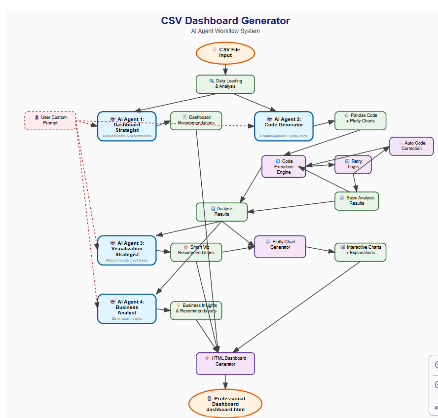

# 🚀 CSV Dashboard Generator

**Transform any CSV file into a professional, AI-powered analytics dashboard in minutes!**

[](https://python.org)
[](https://openai.com)
[](https://plotly.com)

## 📖 Overview

The CSV Dashboard Generator is an intelligent, no-code solution that automatically analyzes your CSV data and creates stunning, interactive dashboards using **4 specialized AI agents**. Simply provide your CSV file and optional custom requirements - the system handles everything else!



## ✨ Key Features

- 🤖 **4 Specialized AI Agents** working together for comprehensive analysis
- 🛡️ **Intelligent Error Handling** with auto-correction and fallback mechanisms  
- 🎨 **Professional Dashboards** with interactive Plotly visualizations
- 💡 **Business Insights** generated automatically from your data
- 🔧 **Fully Customizable** with custom prompts for specific requirements
- 📱 **Responsive Design** that works on all devices

## 🚀 Quick Start

```python
from csv_dashboard_generator import CSVDashboardGenerator

# Initialize with your OpenAI API key and CSV file
generator = CSVDashboardGenerator(
    api_key="your-openai-api-key",
    csv_file_path="your-data.csv"
)

# Optional: Add custom requirements
generator.custom_prompt = "Focus on revenue trends and customer analysis"

# Generate professional dashboard
success = generator.run_complete_analysis("dashboard.html")

if success:
    print("🎉 Dashboard ready! Open dashboard.html in your browser")
```

## 🤖 AI Agent Architecture

- **Agent 1: Dashboard Strategist** - Analyzes data and recommends dashboard structure
- **Agent 2: Code Generator** - Creates pandas analysis code with self-correction
- **Agent 3: Visualization Strategist** - Selects optimal chart types and layouts
- **Agent 4: Business Analyst** - Generates actionable insights and recommendations

## 📊 What You Get

- **Interactive Visualizations**: Charts, graphs, and heatmaps with hover effects
- **Statistical Analysis**: Comprehensive data summaries and correlations
- **Business Insights**: AI-generated executive summaries and recommendations
- **Professional Layout**: Publication-ready HTML dashboard with responsive design

## 🛠️ Requirements

```bash
pip install pandas numpy openai plotly jinja2
```

## 📁 Example Output

The generated dashboard includes:
- 📈 Multiple interactive charts based on your data
- 📊 Statistical analysis tables with explanations
- 💡 AI-generated business insights and recommendations
- 🎨 Professional styling suitable for presentations

---

**Perfect for:** Business analysts, data scientists, researchers, and anyone who needs quick insights from CSV data without coding!
